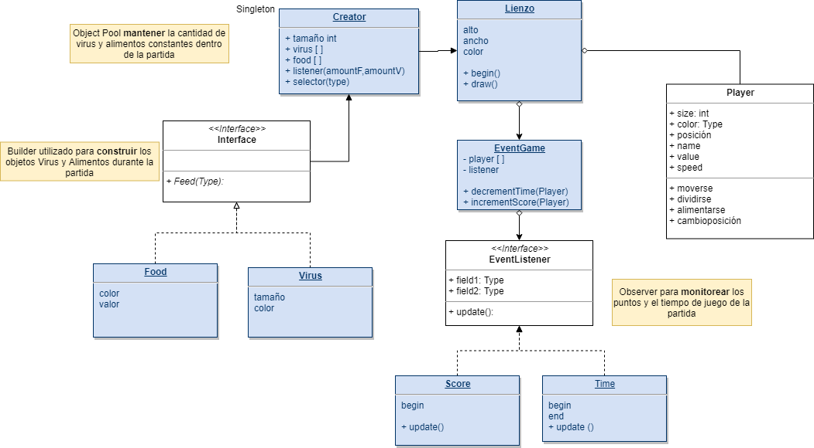
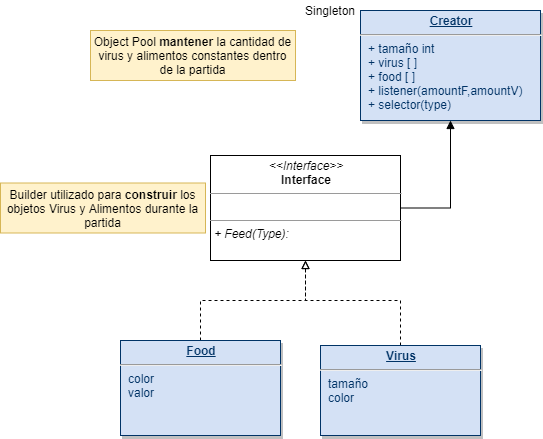
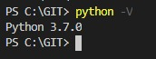
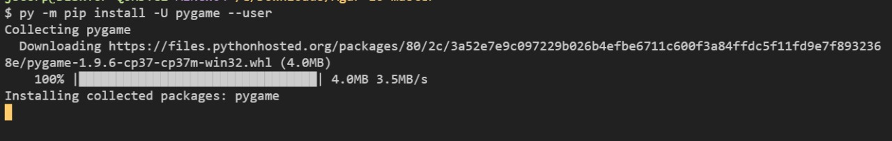
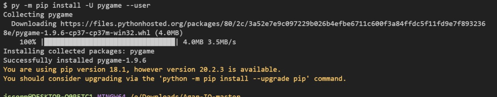
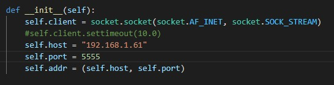
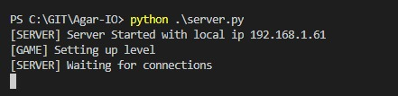
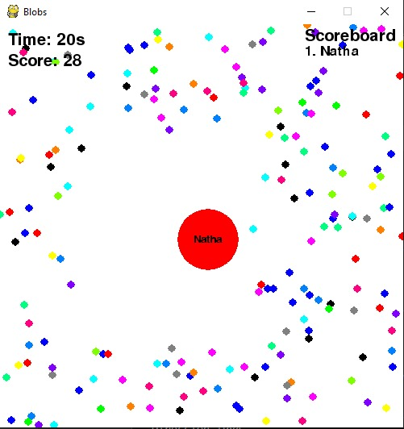

# Implementación AGAR.IO  Grupo 6

> Ingry Nathaly Salamanca Rativa

> Julio Cesar Morales Torres

> Elkin Ortiz Salazar

Implementación del juego AGAR.IO en python utilizando los patrones de diseño de software Object Pool, Builder y Observer para implementación según diagrama



## Object Pool
```sh


```

## Observer y Builder
```sh
Este patron de comportamiento permite definir un mecanismos de suscripcion para notificar 
varios objetos sobre cualquier evento.
El problema a solucionar:
Consite en poder detectar cuando un nuevo jugador se conecta o inicia una partida, 
seria tedioso tanto para el servidor como para el cliente estar enviando la solcitud  
de conexion y entregando la respesra de inicio de partida.
Solucion: 
En este caso, se crea un objeto notificador "event Game", quien tiene como funcion 
principal llevar el control de los jugadores que estan en cuego y los puntajes, 
permitiendo a nuevos jugadores o a los jugadores actualaes llevar un control 
independiente de su puntaje e informando el control de tiempo restante de la partida.

El patrón Observer sugiere que añadas un mecanismo de suscripción a la clase notificadora
para que los objetos individuales puedan suscribirse o cancelar su suscripción a un flujo 
de eventos que proviene de esa notificadora.
```


## Entorno para Ejecución.

### Python versión 3.7.0 o superior


Windows:
```sh
verificación de configuración
```

```sh
Instalación módulos Pygame para desarrollo de video juegos
```

```sh
```

```sh
Configuración del servidor
```

```sh
Configuración cliente
```

```sh
Inicio de partida
```


```sh
```


